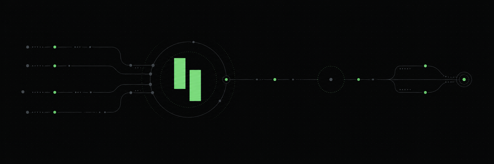

<p align="center">
  <a href="https://getconcord.ai">
    
  </a>
</p>

<h1 align="center">Concord MCP</h1>

<p align="center"><strong>Google Workspace for your AI agents.</strong></p>

<p align="center">
  Give Claude Code, Codex, Cursor, and every MCP-capable coding agent one shared
  place to coordinate work, preserve decisions, and hand off cleanly.
</p>

<p align="center">
  <a href="https://www.npmjs.com/package/@concord-ai/concord-mcp"></a>
  <a href="https://www.npmjs.com/package/@concord-ai/concord-mcp"></a>
  <a href="https://github.com/Get-Concord-AI/concord-mcp/actions/workflows/ci.yml"></a>
  <a href="https://www.npmjs.com/package/@concord-ai/concord-mcp"></a>
  <a href="./LICENSE"></a>
</p>

<p align="center">
  <a href="#quick-start">Quick start</a> ·
  <a href="https://getconcord.ai">Website</a> ·
  <a href="./examples/two-agent-overlap/">Demo</a> ·
  <a href="./CONTRIBUTING.md">Contributing</a>
</p>

> ⚠️ Early and under active development. The public surface is five workflow
> tools covering presence, task memory, versioned ownership, and evidence-rich
> handoffs.

## One workspace. Every agent.

Google Workspace gave human teams a shared place to see, create, and coordinate
work. Concord brings that collaboration layer to coding agents — local-first,
model-agnostic, and built around the repository.

| Without Concord                                     | With Concord                                                   |
| --------------------------------------------------- | -------------------------------------------------------------- |
| Agents discover collisions after editing            | Agents claim files and modules before work begins              |
| Context disappears when a session ends              | Decisions, assumptions, and findings stay attached to the task |
| Ownership is implied by chat history                | Assignments and handoffs are explicit and acknowledged         |
| Humans reconstruct progress from branches and diffs | A live roster and work-state show what is happening now        |
| Review starts with “what changed?”                  | Review packets arrive with scope, tests, risks, and provenance |

Concord is not another autonomous agent. It is the shared workspace around your
agents: presence, task memory, ownership, handoffs, and review state through one
small MCP server.

## Quick start

```bash
npm install -g @concord-ai/concord-mcp
cd /path/to/your/repository
concord setup
```

`concord setup` creates the local `.concord/` workspace, registers the MCP server
(`.mcp.json`, `.cursor/mcp.json`, and Codex's `~/.codex/config.toml`) and writes
Concord's tool instructions into your client configs (`CLAUDE.md`, `AGENTS.md`,
`.codex/`, `.cursor/rules/`). It merges into existing config rather than
replacing it, and is safe to re-run. Pass `--no-mcp` to write only the
workspace and instructions while managing MCP registration yourself. Restart
your client afterwards so it picks up the new server.

In an interactive terminal, setup detects Codex, Claude, and Cursor and asks
once whether to enable their live-prompt integrations. Use
`concord setup --agent-comms` to approve them non-interactively.

- [Claude Code](./docs/claude-code.md)
- [Codex](./docs/codex.md)
- [Cursor](./docs/cursor.md)

> There is no universal `/concord` slash command — commands are client-specific.
> Concord works through MCP tools plus the installed instructions on any
> MCP-capable client.

## Upgrade

When a new Concord version is available, update the global package and confirm
the installed version:

```bash
npm install -g @concord-ai/concord-mcp@latest
concord --version
```

Concord does not auto-update. Upgrading preserves each repository's local
`.concord/` workspace; any required database migrations run automatically when
the workspace is next opened. The interactive `concord` CLI checks npm at most
once per day and prints an update command when a newer stable release is
available. Set `CONCORD_NO_UPDATE_CHECK=1` to disable this best-effort check.

## The tools

| Tool            | Purpose                                                                                     |
| --------------- | ------------------------------------------------------------------------------------------- |
| `start_work`    | registers presence, claims or accepts one task, and reports scope overlaps before editing   |
| `inspect_work`  | reads workspace/task state, an agent inbox/outbox, or a durable prompt/reply thread         |
| `update_work`   | records task context or immediately prompts/replies to another promptable workspace agent   |
| `transfer_work` | assigns, accepts, declines, releases, reassigns, offers handoffs, or reopens versioned work |
| `finish_work`   | records evidence and optionally marks a task review-ready, complete, or closed              |

Writes accept an `agent_id`, which keeps presence live just by working.
`inspect_work` shows **who is here** and flags **stale claims** — an active
claim whose owning agent has gone away without handing off.

For live agent-to-agent communication, run `concord setup --agent-comms` (or
accept the one-time interactive setup prompt), then restart existing client
sessions once. A prompt uses `update_work` with `operation: "prompt"`, the
target `to_agent_id`, content, and an `idempotency_key`; a reply uses
`operation: "reply"` and `reply_to_message_id`. Busy targets are steered into
their current turn, while idle targets start a new turn. Delivery fails
immediately when the named agent has no reachable relay; Concord does not
silently reroute it.

Concord resolves the repository workspace automatically. Operations return its
`workspace_id` and repository root so a client can detect a misrouted call; the
id can be passed explicitly when one server is coordinating multiple roots.

Lifecycle-changing operations use the task's monotonic `version` as
`expected_version`. If two agents act on the same version, only the first
transition succeeds. Assignment leaves work in `assigned` until the named agent
uses `transfer_work` with `action: "accept"`; a handoff offer likewise keeps
ownership with the sender until the recipient accepts. Every ownership change
is retained in an append-only audit history.

### Migrating from the granular surface

The five tools replace the earlier public names; there are no legacy aliases.
Update the package and re-run `concord setup` to refresh generated
instructions. `concord doctor` reports stale instruction blocks.

| Earlier tools                                          | Replacement                                             |
| ------------------------------------------------------ | ------------------------------------------------------- |
| `register_agent`, `claim_work`                         | `start_work`                                            |
| `accept_task`                                          | `start_work` or `transfer_work` with `action: "accept"` |
| `get_work_state`, `get_task_context`                   | `inspect_work`                                          |
| `update_task`                                          | `update_work`                                           |
| `assign_task`, `release_task`, `reassign_task`         | `transfer_work`                                         |
| `offer_handoff`, `accept_handoff`, `decline_handoff`   | `transfer_work`                                         |
| `handoff`, `review_ready`, `close_task`, `reopen_task` | `finish_work` or `transfer_work`                        |

## What you get

SQLite is the local source of truth, kept in the `.concord/` at the **root of
the repo** the work is happening in. The MCP server resolves that root from
`CONCORD_REPO_ROOT` if set, then Claude Code's `CLAUDE_PROJECT_DIR` (which Claude
Code sets automatically, even for a user-scoped server), then its working
directory — so every agent in one repo shares one store. Set `CONCORD_REPO_ROOT`
when running the server somewhere its working directory is not inside the repo.

Linked Git worktrees follow Git's `commondir` metadata to the primary checkout,
so the main checkout and all linked worktrees intentionally share one Concord
database and workspace id.

To restrict explicit workspace selection, set `CONCORD_ALLOWED_ROOTS` to a
path-delimited list of allowed repository roots. Without an allowlist, decoded
roots must still exist and be directories.

`concord setup` adds `.concord/` to the
repository's `.gitignore`, so the generated workspace stays local by default.
Teams that want selected artifacts in PRs can remove that rule or force-add the
human-readable files:

```text
.concord/
├── concord.db          local source of truth
├── HANDOFF.md          human-readable handoff
├── REVIEW_PACKET.md    review-ready evidence
└── WORK_STATE.json     generated export (optional)
```

## CLI

Concord supports both typed MCP tools and a regular CLI. MCP-capable agents can
call the tools directly; humans and CLI-oriented agents can work with the same
shared workspace through `concord` commands.

```bash
concord setup                # set up local state, instructions, and MCP clients
concord status               # roster, active work, overlaps, stale claims, review-ready
concord dashboard            # live, keyboard-driven view of agents, tasks, alerts, and activity
concord who                  # which agents are present and what they are working on
concord tasks                # list all tracked tasks
concord handoff <task-id>    # print the latest handoff
concord review-packet <id>   # print the latest review packet
concord export markdown      # regenerate .concord/ artifacts
concord doctor               # workspace checks + per-task tool adoption

concord --repo ../project status        # select by repository path from anywhere
concord --workspace ws_... status       # select an id returned by a Concord operation
```

`--repo` and `--workspace` are global, mutually exclusive options. The CLI uses
the same `CONCORD_REPO_ROOT` → `CLAUDE_PROJECT_DIR` → working-directory priority
and the same linked-worktree canonicalization as MCP.

`concord dashboard` is a read-only, full-screen local TUI. It refreshes from the
shared SQLite workspace every second while keeping agents, tasks, alerts,
context, and timeline inside a fixed terminal viewport. Use `Tab` to change
panes, `j`/`k` or the arrow keys to select work, `/` to filter, `?` for help,
and `q` to quit.

## Try the demo

```bash
pnpm demo
```

Runs the [two-agent overlap demo](./examples/two-agent-overlap/): two agents
claim overlapping work, share and read task context, then one hands off and
marks the task review-ready. The example also includes a two-terminal flow for
watching those real MCP calls appear live in `concord dashboard`.

## What this is / is not

Shared work-state and task memory for coding agents using the same local
checkout. **Not** an orchestrator, code reviewer, hosted sync service, memory
vector DB, or autonomous coding agent.

See also: [Why not just use markdown?](./docs/why-not-markdown.md)

## Contributing

See [`CONTRIBUTING.md`](./CONTRIBUTING.md) and [`CLAUDE.md`](./CLAUDE.md). This
repo is strictly typed (no `any`, no typecasts), modular, and every PR stays under
600 LOC. Good first issues are labelled [`good first issue`](https://github.com/Get-Concord-AI/concord-mcp/labels/good%20first%20issue).

## Star History

<a href="https://www.star-history.com/?repos=Get-Concord-AI%2Fconcord-mcp&type=date&legend=top-left">
 <picture>
   <source media="(prefers-color-scheme: dark)" srcset="https://api.star-history.com/chart?repos=Get-Concord-AI/concord-mcp&type=date&theme=dark&legend=top-left&sealed_token=DbdI1sO4OagCGFjVA8u5Muv8TyjExR3cllFEq-O_HR3Lzj1jwj7p3N1KuL5fqohiyjzgevkwPQTT8oAw-rZfwTGNwRcTD9sb7aM0pDiJ6ZFGbGY2swwz0CNpbh3Usu4Dw6UIXBDuXacj3SBUTvdU7UYqEcAZtYdlTqUphLqPIrnMJa9WbAbg4ksGqaU2" />
   <source media="(prefers-color-scheme: light)" srcset="https://api.star-history.com/chart?repos=Get-Concord-AI/concord-mcp&type=date&legend=top-left&sealed_token=DbdI1sO4OagCGFjVA8u5Muv8TyjExR3cllFEq-O_HR3Lzj1jwj7p3N1KuL5fqohiyjzgevkwPQTT8oAw-rZfwTGNwRcTD9sb7aM0pDiJ6ZFGbGY2swwz0CNpbh3Usu4Dw6UIXBDuXacj3SBUTvdU7UYqEcAZtYdlTqUphLqPIrnMJa9WbAbg4ksGqaU2" />
   
 </picture>
</a>

## Privacy & telemetry

Concord sends anonymous product-usage metadata to `getconcord.ai` so we can
measure active installations, feature adoption, errors, and performance. Events
contain random installation/session identifiers, an irreversible per-install
workspace pseudonym, Concord/Node/platform versions, normalized MCP client
metadata, and MCP tool or CLI command names, outcomes, and durations.

Concord never sends code, raw file or repository paths, remotes, usernames,
task or agent identifiers, command arguments, tool inputs/outputs, or task
content. Set `CONCORD_TELEMETRY_DISABLED=1` (or `DO_NOT_TRACK=1`) to disable
telemetry. Delivery is best effort and can never make a Concord operation fail.

## License

[MIT](./LICENSE)
